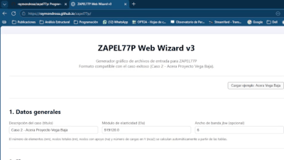

🏗️ ZAPEL77P Web Wizard v3
Generador gráfico moderno para archivos de entrada del programa ZAPEL77P

📌 Resumen

ZAPEL77P Web Wizard v3 es una herramienta visual, moderna y fácil de usar que genera archivos de entrada válidos para el programa ZAPEL77P, utilizado para análisis estructural basado en elementos tipo viga.

Este wizard permite crear modelos estructurales mediante una interfaz gráfica intuitiva, visualizar elementos, apoyos y cargas, y exportar el archivo .txt listo para ser procesado por ZAPEL77P.

🎥 DEMO Oficial

Vista rápida del funcionamiento del Wizard:

🔗 Enlaces del Proyecto

🌐 Página Web (GitHub Pages):
https://raymondrosa.github.io/zapel77p/

📁 Repositorio GitHub:
https://github.com/raymondrosa/zapel77p

🚀 Características principales
🎨 Interfaz gráfica interactiva

Canvas con nodos, elementos y apoyos

Flechas animadas para cargas nodales

Escalado automático

Identificación numérica clara

🧮 Generación automática del archivo ZAPEL

Formato validado y probado

Alineación exacta de columnas

Conversión sin errores a .txt

Soporta cargas distribuidas (pa, pb)

Soporta cargas nodales en Y

Soporta apoyos compactos tipo:
3 1 0 1 0 3 1 1 0 4 0 1 0

🧱 Construcción modular

Elementos con I, A, L, pa, pb

Apoyos kx, ky, kr

Cargas nodales Fy

Módulo de elasticidad

Descripción del caso

🧪 Caso de ejemplo incluido

Caso 2 – Acera Proyecto Vega Baja
Con todos los datos preconfigurados.

🖼️ Capturas del Wizard
🔹 1. Datos Generales

🔹 2. Elementos

🔹 3. Soportes

🔹 4. Cargas Nodales

🔹 5. Vista gráfica del modelo

🔹 6. Archivo generado

📝 Ejemplo de archivo generado
 1
Caso 2 - Acera Proyecto Vega Baja
  3  4  3  0  6  0  1  0  519120.0
  1  1  2   .0241  1.66  5.00
  2  2  3   .0241  1.66  5.00
  3  3  4   .0241  1.66 10.00                    -.25  -.25
 3 1 0 1 0 3 1 1 0 4 0 1 0
 1 2   -2.47

Este archivo ha sido probado con ZAPEL77P.EXE con éxito.

📂 Estructura del Repositorio
📁 zapel77p
│
├── index.html
├── styles.css
├── app.js
├── assets/
│   ├── wizard_demo.gif
│   ├── (capturas optimizadas)
├── acera.txt
├── acera.out
└── README.md

🛠️ Cómo usar el Wizard
🔹 Desde la web (recomendado)

Abrir: https://raymondrosa.github.io/zapel77p/

Configurar elementos, apoyos y cargas

Visualizar la viga en el canvas

Generar archivo .txt

Ejecutarlo en ZAPEL77P

🔹 Localmente

Descargar o clonar el repositorio

Abrir index.html en un navegador moderno

🎯 Objetivo del Proyecto

El objetivo es ofrecer una herramienta educativa y profesional para:

Simplificar el uso de ZAPEL77P

Reducir errores en la creación de modelos

Visualizar estructuras en tiempo real

Agilizar el análisis para estudiantes e ingenieros

👨‍🏫 Autoría

Proyecto desarrollado para el
Prof. Raymond Rosa Ávila, Asesor Estructural y Profesor Universitario.

Asistencia técnica provista por MisterBot.

🤝 Contribuciones

Las sugerencias son bienvenidas:

Issues

Pull Requests

Recomendaciones académicas

📜 Licencia

Este proyecto está licenciado bajo:

Creative Commons Attribution–NonCommercial 4.0 (CC BY-NC 4.0)

🔗 https://creativecommons.org/licenses/by-nc/4.0/

Esto permite:

✔ Usar
✔ Compartir
✔ Modificar
❌ No permite uso comercial
✔ Requiere atribución al autor
